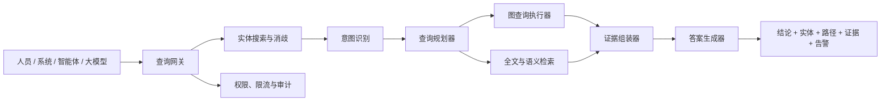

# 查询层设计方案

## 1. 定位

查询层位于Neo4j图事实之上、人员/智能体/大模型之下，定位为：

```text
图事实查询引擎 + 证据服务 + 智能解释层
```

查询层不向调用方开放任意Cypher，也不允许LLM直接决定图数据库查询。自然语言问题先转换为受控查询计划，再组合一个或多个查询原语。

## 2. 使用对象

- 人员：搜索指标、查看口径、追溯血缘、执行影响分析。
- 业务系统：通过稳定API获取结构化图谱事实。
- 智能体：通过MCP或工具调用组合多个查询原语。
- 大模型：基于查询结果和证据生成解释，不自行补造血缘。

## 3. 查询类型

### 3.1 确定性查询

直接查询任务、表、字段、指标及明确图关系，不需要LLM参与。

### 3.2 语义检索

根据中文名称、英文名称、别名、描述和上下文搜索实体，并处理同名指标、同名字段等歧义。

### 3.3 混合问答

图谱提供事实范围，LLM仅负责理解问题、组合查询和解释结果。所有关键结论必须引用图路径或原始证据。

## 4. 总体架构



## 5. 查询原语

查询原语是位于自然语言和Neo4j之间的最小、稳定、可组合查询能力。同一原语可以暴露为Python函数、REST API、MCP工具或智能体Tool。

第一版定义12个业务查询原语：

| 序号 | 原语 | 作用 |
|---:|---|---|
| 1 | `search_entities` | 按名称、ID和描述搜索实体 |
| 2 | `resolve_entity` | 结合上下文将候选解析为唯一实体 |
| 3 | `get_metric_context` | 查询指标、存储、任务及多种口径 |
| 4 | `get_task_context` | 查询任务代码、输入输出和调度依赖 |
| 5 | `get_dataset_context` | 查询表结构、生产消费和指标 |
| 6 | `get_column_context` | 查询字段元数据及字段血缘 |
| 7 | `trace_upstream` | 从任务、表、字段或指标追溯源头 |
| 8 | `trace_downstream` | 查询完整下游路径 |
| 9 | `analyze_impact` | 分析任务、表或字段变更影响 |
| 10 | `compare_metric_definitions` | 查询代码、登记和人工补充口径比较 |
| 11 | `find_definition_issues` | 批量检索口径冲突、缺失和待复核项 |
| 12 | `explain_lineage_path` | 解释两个实体间血缘为何成立 |

`get_graph_status`作为查询网关公共接口，不占业务原语名额。

## 6. 标准请求

通用请求结构：

```json
{
  "project_id": "trial_project",
  "subject": {
    "entity_id": "column:dm_xxx.table_a.running_phase",
    "entity_type": "column"
  },
  "max_hops": 20,
  "limit": 100,
  "cursor": null,
  "include_evidence": true,
  "include_properties": true,
  "confidence_min": "medium",
  "mode": "balanced"
}
```

查询模式：

| 模式 | 行为 |
|---|---|
| `strict` | 只返回明确图关系 |
| `balanced` | 返回明确关系和中置信度推导，默认模式 |
| `exploratory` | 增加SQL文本兜底和名称匹配 |

## 7. 标准响应

所有原语返回统一信封：

```json
{
  "request_id": "req_xxx",
  "primitive": "analyze_impact",
  "status": "ok",
  "answer": "预计影响26个任务和21张表。",
  "data": {},
  "entities": [],
  "paths": [],
  "evidence": [],
  "warnings": [],
  "graph_context": {},
  "page": {},
  "diagnostics": {}
}
```

### 7.1 状态

| 状态 | 含义 |
|---|---|
| `ok` | 查询成功且证据完整 |
| `partial` | 查询成功，但证据不完整或结果截断 |
| `ambiguous` | 输入对应多个候选实体 |
| `not_found` | 未找到目标实体 |
| `error` | 查询执行失败 |

证据不足属于`partial`，不属于系统错误。

### 7.2 实体引用

```json
{
  "entity_id": "task:152285",
  "entity_type": "schedule_task",
  "key": "152285",
  "display_name": "生命周期策略明细加工",
  "properties": {
    "task_type": "sparkIndex",
    "owner": ["zhangsan"],
    "layer": "dm"
  }
}
```

第一版实体类型：`project`、`schedule_task`、`sql_statement`、`dataset`、`column`、`metric`、`metric_definition`、`code_definition`、`definition_comparison`、`owner`、`data_layer`。

### 7.3 血缘路径

```json
{
  "path_id": "path_xxx",
  "direction": "downstream",
  "hop_count": 3,
  "confidence": "high",
  "nodes": ["column:dm_a.t1.running_phase", "column:dm_b.t2.running_phase"],
  "edges": [
    {
      "type": "DERIVED_FROM",
      "from": "column:dm_b.t2.running_phase",
      "to": "column:dm_a.t1.running_phase",
      "confidence": "high",
      "inferred": false
    }
  ]
}
```

图中`DERIVED_FROM`方向为目标字段指向来源字段。下游查询需要反向遍历，但响应中的`direction`始终表达用户视角。

### 7.4 证据

```json
{
  "evidence_id": "ev_xxx",
  "evidence_type": "sql_statement",
  "supports": ["column:dm_b.t2.running_phase"],
  "source_entity_id": "sql:statement_xxx",
  "task_id": "152285",
  "excerpt": "select running_phase ...",
  "source_type": "task_page_sql",
  "derivation": "sqlglot_column_lineage",
  "confidence": "high",
  "build_id": "build_xxx"
}
```

证据类型限定为：

```text
schedule_relation
task_metadata
sql_statement
runtime_log
table_metadata
column_metadata
registered_definition
code_definition
manual_override
name_match
sql_text_fallback
```

### 7.5 图版本上下文

```json
{
  "project_id": "trial_project",
  "graph_prefix": "strategy_llm",
  "build_id": "build_xxx",
  "built_at": "2026-06-30T18:30:00+08:00",
  "last_scan_at": "2026-06-30T18:38:44+08:00",
  "is_latest": true,
  "has_pending_change": false
}
```

所有业务响应必须携带图版本，避免用户将过期图谱结果当作当前事实。

### 7.6 告警

统一告警码：

```text
ENTITY_AMBIGUOUS
EVIDENCE_INSUFFICIENT
LINEAGE_PARTIAL
SQL_FALLBACK_ONLY
RESULT_TRUNCATED
MAX_HOPS_REACHED
GRAPH_STALE
CODE_CHANGED
MANUAL_REVIEW_REQUIRED
REGISTERED_DEFINITION_CONFLICT
PERMISSION_FILTERED
```

权限过滤必须显式返回`PERMISSION_FILTERED`，不能静默遗漏结果。

### 7.7 分页和诊断

大结果集使用游标分页：

```json
{
  "limit": 100,
  "returned": 100,
  "next_cursor": "cursor_xxx",
  "has_more": true
}
```

诊断信息可以包含耗时、查询模板ID、Neo4j查询次数和候选数量，但不得暴露凭证或任意动态Cypher。

## 8. 原语详细契约

### 8.1 search_entities

输入：`query`、`entity_types`、`project_id`、`limit`。

输出：候选实体、匹配分数、匹配字段和匹配方式。匹配方式分为`exact`、`prefix`、`fuzzy`、`semantic`。多个高分候选时返回`ambiguous`。

### 8.2 resolve_entity

输入：查询文本及可选的实体类型、所属表、项目等上下文。

输出：唯一实体，或候选列表和歧义原因。不能在多个候选分数接近时静默选择。

### 8.3 get_metric_context

输出：指标名称、存储表和字段、计算任务、登记口径、代码口径、人工补充、有效口径、比较状态、核心SQL、来源表及证据充分性。

有效口径规则：

```text
有效人工补充 > 证据充分的代码口径 > 登记口径
```

人工补充为`needs_review=true`时，只作为历史参考并返回告警。

### 8.4 get_task_context

输出：任务类型、负责人、周期、页面代码或运行SQL、直接上下游任务、读取表、写入表、相关指标及最近变化状态。

### 8.5 get_dataset_context

输出：库表名、注释、负责人、数据层、字段、生产任务、消费任务、来源表、下游表、承载指标和分层合规情况。

### 8.6 get_column_context

输出：字段类型、注释、所属表、来源字段、下游字段、相关SQL、任务、指标和血缘置信度。

### 8.7 trace_upstream

支持任务、表、字段和指标作为起点。参数包括`max_hops`、`stop_layers`、`confidence_min`。输出源头实体、完整路径和是否达到最大深度。

### 8.8 trace_downstream

返回完整下游路径，不直接判断业务是否必须修改。变更必要性由`analyze_impact`判断。

### 8.9 analyze_impact

支持主体类型：`schedule_task`、`dataset`、`column`。

支持变更类型：`drop`、`rename`、`type_change`、`logic_change`、`stop_production`、`schedule_change`。

输出分为：

- `must_change`：明确字段血缘或SQL引用。
- `likely_affected`：高概率影响。
- `indirectly_affected`：通过任务或表血缘间接影响。
- `text_match_only`：只在SQL文本中命中。
- `unknown`：证据不足，无法判断。

### 8.10 compare_metric_definitions

查询已有比较事实，不在每次请求中重新调用LLM。输出登记口径、代码口径、人工补充、一致点、冲突点、证据缺口、当前有效口径和复核状态。

### 8.11 find_definition_issues

支持按问题类型、负责人、表和项目过滤。问题类型包括`conflict`、`partially_consistent`、`code_evidence_insufficient`、`registry_missing`和`manual_review_required`。

### 8.12 explain_lineage_path

输入起点和终点实体，输出最短路径、可选替代路径、每一跳关系成立的原因、综合置信度及证据缺口。

## 9. 组合查询示例

“打新次数如何计算，修改来源表会影响什么”：

```text
search_entities
→ resolve_entity
→ get_metric_context
→ trace_upstream
→ analyze_impact
→ explain_lineage_path
```

“删除running_phase需要修改哪些任务”：

```text
search_entities
→ resolve_entity
→ analyze_impact
→ get_task_context（批量）
→ explain_lineage_path
```

## 10. 查询限制

- `max_hops`默认20，最大50。
- 单次最多返回100个实体和20条完整路径。
- 默认使用`balanced`模式。
- SQL证据片段默认最多1000字符。
- 不允许调用方提交任意Cypher。
- 第一版只查询当前正式图版本。
- 历史版本和时间点查询暂缓。
- 超限结果必须返回`RESULT_TRUNCATED`。

## 11. 权限与审计

- 项目、表、字段和SQL证据需要支持权限过滤。
- 记录调用人、原语、实体、查询时间、图版本和结果规模。
- 智能体调用和人员调用使用同一权限上下文。
- SQL和运行日志片段按权限返回，必要时只返回证据ID。
- 禁止查询层返回Cookie、Token、API Key和数据库凭证。

## 12. MVP范围

第一期实现：

1. 统一协议和错误码。
2. 12个查询原语的JSON Schema。
3. 参数化Cypher模板。
4. 图版本与增量状态返回。
5. 基于现有`trial_project`的验收用例。
6. Python服务接口，为REST和MCP复用。

第一期暂不实现：聊天页面、任意Cypher控制台、向量数据库、复杂图可视化、历史版本查询和自动修改代码。

## 13. 验收原则

- 相同输入和图版本产生稳定结构化结果。
- 每个关键结论至少关联一项证据或明确告警。
- 歧义实体不会被静默选择。
- 字段影响结果能区分明确、推导和文本兜底。
- 证据不足返回`partial`而不是伪造确定结论。
- 图谱过期或存在待发布变更时返回`GRAPH_STALE`或`CODE_CHANGED`。
- 所有查询都满足跳数、数量、权限和耗时限制。
