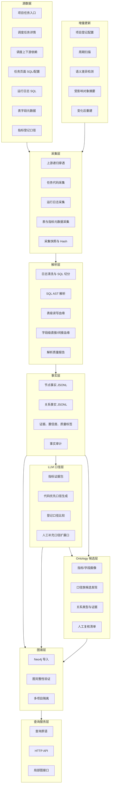

# 大数据代码逆向知识图谱技术方案

## 1. 建设目标

本项目从调度任务、运行态 SQL、任务配置、表字段元数据和指标登记信息出发，逆向还原大数据项目的加工逻辑，形成面向人员、智能体和大模型可查询、可解释、可审计的代码知识图谱。

核心目标：

- 还原项目内任务、SQL、表、字段、指标和口径之间的关系。
- 支持代码口径、业务口径、取数逻辑、上下游血缘和变更影响分析。
- 为大模型提供带边界、来源、置信度和证据链的可信上下文。
- 支持多项目导入、项目内查询和轻量展示。
- 保留可复核的中间事实文件，使图谱可重建、可验证、可迁移。

## 2. 当前整体能力

当前项目已形成一套可复用流水线：

```text
结果任务 ID / 项目任务清单
→ 递归采集上游调度依赖和任务元信息
→ 采集任务页面代码、运行日志 SQL、表字段元数据、指标登记口径
→ 清洗并解析 SQL
→ 抽取表级血缘和字段级血缘
→ 生成统一节点、边事实 JSONL
→ 生成 LLM 指标代码口径并与登记口径比较
→ 导入 Neo4j
→ 通过查询 API 和离线校验验证图谱质量
```

当前已支持多项目导入和按 `project_id` 隔离查询。已验证项目包括：

| project_id | 项目名称 |
| --- | --- |
| `digital_operations` | 数字化运营 |
| `project_customer_report` | 客户报告 |
| `project_stastic_month` | 统计月报 |
| `t0` | T0 |
| `project_sale_new` | 交叉销售 |
| `sale` | 交叉销售（全） |
| `iresearch` | 研究业务 |
| `trial_project` | 试验项目 |

## 3. 总体架构



## 4. 采集层

采集层负责把分散在调度、日志、元数据和指标登记中的信息统一落盘，形成可重放的项目原始产物。

### 4.1 输入方式

项目以一组结果任务 ID 作为入口。系统会从入口任务向上递归穿透，直到没有上游依赖或达到用户配置的深度、节点上限。

对于无法通过标准调度关系自动发现的任务，保留人工登记扩展口，由用户维护补充任务 ID。

### 4.2 代码来源策略

任务代码按“运行态优先、配置兜底”的原则采集：

| 任务类别 | 主要代码来源 | 说明 |
| --- | --- | --- |
| Hive 类任务 | 最新成功运行日志 | 以实际运行 SQL 为准 |
| Spark 指标类任务 | 任务页面配置 | 页面中 `prepare.sqls` 用于识别写入目标 |
| 其他任务 | 任务页面配置 | 页面 SQL、同步配置或任务参数为主 |
| 页面不可用场景 | 运行日志兜底 | 仅在主来源缺失时使用 |

Git 设计态代码采集当前暂不作为主链路。

### 4.3 采集产物

典型项目产物包括：

```text
lineage.json
task_details.json
code_artifacts_page.json
log_artifacts_full.json
strategy_sql_statements.json
strategy_graph_nodes.jsonl
strategy_graph_edges.jsonl
strategy_fact_audit.json
strategy_quality_report.json
sz_metadata/
llm/
incremental/
```

## 5. 解析层

解析层负责从 SQL 和配置中抽取结构化事实，当前以 SQL 解析为核心。

### 5.1 SQL 处理

处理流程：

1. 清理 Spark/Hive 配置、执行日志、进度信息和引擎噪声。
2. 从任务页面或运行日志中切分 SQL 语句。
3. 使用 `sqlglot` 按 Spark/Hive 方言解析 AST。
4. 对解析不完整的 DDL、CTAS 或运行态片段做保守兜底。
5. 合并页面代码、运行日志代码和策略 SQL，形成项目统一 SQL 事实。

### 5.2 表级血缘

表级血缘的核心事实包括：

```text
SqlStatement -[:READS]-> Dataset
SqlStatement -[:WRITES]-> Dataset
Dataset -[:DATASET_DEPENDS_ON]-> Dataset
ScheduleTask -[:PRODUCES]-> Dataset
ScheduleTask -[:CONSUMES]-> Dataset
```

表级血缘主要用于任务链路、资产依赖、项目全貌和变更影响分析。

### 5.3 字段级血缘

字段级血缘分为两类：

| 关系 | 含义 |
| --- | --- |
| `DERIVED_FROM` | 目标字段值直接来自源字段，例如投影、别名、表达式计算 |
| `INFLUENCED_BY` | 源字段通过过滤、关联、分组、排序等方式影响结果，但不一定直接构成目标字段值 |

当前已支持：

- 表别名解析。
- 单一来源表匹配。
- Schema 唯一字段匹配。
- CTE 传播。
- CTAS 目标识别。
- UNION / UNION ALL 分支投影。
- `A.*`、`B.*` 等星号展开。
- 过滤、关联、分组、HAVING、QUALIFY、排序等间接影响识别。

字段血缘采用保守原则：证据不足时不强行建立确定性 `DERIVED_FROM`。没有字段血缘边表示当前证据不足，不等同于业务上绝对无依赖。

## 6. 事实层

事实层将采集和解析结果统一转成可入图的节点、边 JSONL。

### 6.1 统一事实属性

每个节点和关系都会携带：

```text
fact_type
project_key
graph_prefix
build_id
built_at
confidence
inferred
quality_score
quality_tier
knowledge_admission
```

关系还会尽量携带：

```text
task_id
statement_id
source_type
source_resolution
evidence_from_id
evidence_to_id
influence_type
```

### 6.2 知识质量和入图准则

当前采用轻量质量评分：

```text
quality_score =
  confidence_score
+ source_score
+ evidence_score
+ review_bonus
- inferred_penalty
```

评分维度：

| 维度 | 规则 |
| --- | --- |
| `confidence_score` | `high=35`，`medium=25`，`low=10`，`unknown=0` |
| `source_score` | 权威采集/解析来源得 25；其他有来源得 15；无来源得 8 |
| `evidence_score` | 有 SQL、任务或端点证据得 20；否则得 8 |
| `review_bonus` | 人工确认后加 5 |
| `inferred_penalty` | 推断事实扣 10 |

质量分层：

| 分数 | `quality_tier` | `knowledge_admission` | 使用建议 |
| ---: | --- | --- | --- |
| `>=75` | `high_quality` | `accepted` | 可作为可信知识使用 |
| `50-74` | `usable_with_context` | `accepted` 或 `accepted_with_inference` | 可用，但回答时应带证据上下文 |
| `30-49` | `candidate` | `needs_review` | 可作为线索，建议复核 |
| `<30` | `low_quality` | `temporary_context` | 仅作临时上下文，不给确定结论 |

当前策略不是低质量事实不入图，而是**全部入图、分层使用**。查询层和大模型回答层可以根据质量标签过滤或降权。

## 7. 图谱模型

### 7.1 主要节点

| 节点 | 含义 |
| --- | --- |
| `Project` | 项目 |
| `ScheduleTask` | 调度任务 |
| `RuntimeLog` | 运行日志证据 |
| `SqlStatement` | SQL 语句 |
| `Dataset` | 表或外部数据集 |
| `Column` | 字段 |
| `Metric` | 指标 |
| `MetricDefinition` | 登记口径 |
| `CodeDefinition` | LLM 从代码证据生成的代码口径 |
| `DefinitionComparison` | 登记口径与代码口径比较结果 |
| `GeneratedExpression` | 无法直接落到源字段的生成表达式 |
| `Owner` | 负责人 |

### 7.2 主要关系

| 关系 | 含义 |
| --- | --- |
| `HAS_ENTRY_TASK` | 项目包含入口任务 |
| `DEPENDS_ON` | 调度任务依赖 |
| `HAS_RUNTIME_LOG` | 任务拥有运行日志 |
| `EMITS_SQL` | 任务产出 SQL 语句 |
| `READS` | SQL 读取表 |
| `WRITES` | SQL 写入表 |
| `PRODUCES` | 任务产出表 |
| `CONSUMES` | 任务消费表 |
| `DATASET_DEPENDS_ON` | 表依赖表 |
| `HAS_COLUMN` | 表包含字段 |
| `DERIVED_FROM` | 字段直接来源 |
| `INFLUENCED_BY` | 字段间接受影响 |
| `GENERATED_BY_EXPRESSION` | 字段由表达式生成 |
| `STORED_IN` | 指标存储在表或字段 |
| `COMPUTED_BY` | 指标由任务计算 |
| `HAS_DEFINITION` | 指标有登记口径 |
| `HAS_CODE_DEFINITION` | 指标有代码口径 |
| `HAS_COMPARISON` | 指标有口径比较结果 |
| `OWNS` | 负责人归属 |

## 8. LLM 指标口径

LLM 口径层只在用户授权后运行，当前主要面向指标。

### 8.1 LLM 作用

LLM 不替代图谱事实抽取。它的作用是：

- 基于代码证据包生成“代码优先口径”。
- 将代码口径与登记口径进行一致性比较。
- 给出差异类型、证据摘要和是否需要人工复核。

### 8.2 证据包

每个指标的证据包可包含：

- 指标名称、英文名和登记口径。
- 指标存储表、字段和关联任务。
- 写入 SQL、来源 SQL、字段血缘和表级血缘。
- 表字段元数据。
- 模型名称、证据包 Hash 和执行状态。

### 8.3 比较状态

当前比较状态包括：

| 状态 | 含义 |
| --- | --- |
| `consistent` | 代码口径与登记口径基本一致 |
| `partially_consistent` | 部分一致，但存在范围、粒度、过滤或公式差异 |
| `conflict` | 代码口径与登记口径存在明显冲突 |
| `registry_missing` | 缺少登记口径 |
| `code_evidence_insufficient` | 代码证据不足，不能给出确定性口径 |
| `manual_review_required` | 需要人工确认 |

人工补充采用轻量扩展文件 `manual_metric_overrides.json`，不建设完整审批流。

## 9. Ontology 候选发现

Ontology 候选层用于从现有图谱事实中发现“项目里可能存在的业务对象、业务属性、度量概念、参考数据和跨表概念关系”。当前保留第二版路线，即 `ontology_v2/`：

```text
表主题识别 -> 字段组语义归纳 -> 血缘证据验证 -> 跨表概念对齐 -> 可选 LLM 精炼
```

第二版不再依赖单字段相似度来直接推断口径族，而是先理解表，再归纳表内字段组，然后用血缘证据验证，最后做跨表概念对齐。所有自动发现结果默认只作为候选，不直接改变正式图谱结论。

### 9.1 输入证据

输入为项目图谱产物目录，优先读取：

```text
strategy_llm_graph_nodes.jsonl
strategy_llm_graph_edges.jsonl
```

如果没有 LLM 图谱产物，则回退读取：

```text
strategy_graph_nodes.jsonl
strategy_graph_edges.jsonl
```

主要使用以下证据：

- 指标名称、英文名、登记口径、代码口径、口径比对状态。
- 指标存储表、代码来源表、计算任务。
- 字段名称、字段注释、所属表。
- 字段直接血缘、间接影响血缘、共同上游和共同下游。
- 节点和边上的 `confidence`、`quality_score`、`knowledge_admission`。

### 9.2 表主题与字段组发现

一键执行：

```bash
python3 run_ontology_v2.py <project_dir> \
  --prefix strategy \
  --project-key <project_id>
```

默认内部四步：

| 步骤 | 脚本 | 输出 |
| --- | --- | --- |
| 表主题识别 | `build_table_profiles.py` | `table_profiles.jsonl` |
| 字段组语义归纳 | `discover_field_groups.py` | `field_groups.jsonl` |
| 血缘路径验证 | `verify_concept_evidence.py` | `verified_field_groups.jsonl`、`field_group_relations.jsonl` |
| 跨表概念对齐 | `align_concepts.py` | `concept_candidates.jsonl`、`concept_relations.jsonl` |

默认流程为离线规则版，不依赖 LLM。需要更自然的业务解释和拆并建议时，可以显式启用 LLM 精炼：

```bash
python3 refine_ontology_concepts_with_llm.py <project_dir> \
  --provider openai-compatible \
  --model deepseek-v4-pro \
  --base-url https://api.deepseek.com \
  --limit 5 \
  --min-score 0.79
```

也可以在一键流程中启用：

```bash
python3 run_ontology_v2.py <project_dir> \
  --prefix strategy \
  --project-key <project_id> \
  --refine-ontology-llm \
  --llm-provider openai-compatible \
  --llm-model deepseek-v4-pro \
  --llm-base-url https://api.deepseek.com
```

LLM 精炼不会覆盖规则候选，而是生成独立的 `OntologyLLMRefinement` 事实，用于解释候选概念、给出拆分/合并建议、列出证据边界和业务复核问题。

新增候选节点类型：

| 节点 | 含义 |
| --- | --- |
| `TableProfile` | 表主题画像，如结果事实表、参数配置表、主数据表、关系映射表 |
| `SemanticFieldGroup` | 表内字段组，如合约/协议、交易对手/客户、产品/标的、销售收入 |
| `OntologyEvidence` | 字段组的血缘证据验证结果 |
| `ConceptCandidate` | 跨表对齐后的候选业务概念 |
| `OntologyLLMRefinement` | LLM 对候选概念的业务命名、解释、拆并建议和证据边界 |

新增候选关系类型：

| 关系 | 含义 |
| --- | --- |
| `HAS_TABLE_PROFILE` | 表关联表画像 |
| `HAS_FIELD_GROUP` | 表画像关联字段组 |
| `CONTAINS_COLUMN` | 字段组包含字段 |
| `SUPPORTED_BY` | 字段组由血缘证据支持 |
| `DERIVED_FROM_GROUP` | 字段组之间存在字段血缘派生 |
| `ALIGNED_TO` | 字段组对齐到候选概念 |
| `REFINED_BY_LLM` | 候选概念关联 LLM 精炼结果 |

`project_sale_new` 的 `ontology_v2` 验证结果：

| 项 | 数量 |
| --- | ---: |
| 表画像 | 370 |
| 字段组 | 675 |
| 强证据字段组 | 134 |
| 字段组派生关系 | 311 |
| 跨表概念候选 | 78 |
| 跨表候选关系 | 2929 |

抽样可以发现“场外衍生品销售日报”“合约/协议”“交易对手/客户”“产品/标的”“销售收入/创收”“费率/费用/收益率”“本金/保证金”等业务对象和概念族。

接入 DeepSeek 后，对 `project_sale_new` 5 个高分候选做真实 LLM 精炼：

| 规则候选 | LLM 建议概念名 | 置信度 | 关键判断 |
| --- | --- | --- | --- |
| 本金/保证金 | 场外衍生品名义本金与保证金 | high | 建议拆成“名义本金”和“保证金”两个概念 |
| 时间/生命周期 | 合约生命周期关键日期 | medium | 可保留整体，但需区分约定日期、实际执行日期和系统 ETL 日期 |
| 交易对手/客户 | 交易对手 | medium | 建议确认“交易对手”和“客户”是否等价 |
| 合约/协议 | OTC 衍生品公司销售协议 | high | 强证据集中在 `t98_otc_deri_comp_sale_info` 系列表 |
| 费率/费用/收益率 | 场外衍生品合约费率/费用/收益率 | high | 建议按费率、费用、收益率，或按期权/TRS 业务类型拆分 |

### 9.3 输出产物

`ontology_v2/` 输出：

```text
table_profiles.jsonl
field_groups.jsonl
verified_field_groups.jsonl
field_group_relations.jsonl
concept_candidates.jsonl
concept_relations.jsonl
llm_refined_concepts.jsonl
ontology_llm_refinement_summary.json
*_graph_nodes.jsonl
*_graph_edges.jsonl
ontology_v2_manifest.json
```

### 9.4 入图原则

Ontology 候选采用“候选先行、人工确认、确认后入正式知识”的原则：

- 自动发现结果默认 `knowledge_admission=needs_review`。
- 高分候选也不自动等同于标准口径。
- 人工确认后可升级为正式 `ConceptFamily`、`BELONGS_TO_FAMILY`、`SAME_SOURCE_VARIANT` 等关系。
- 低证据或冲突候选保留在复核清单，不参与确定性问答。

## 10. 增量更新

当前增量更新采用“轻量检测、变化后整项目重建”的策略。

### 10.1 检测内容

- 任务新增、删除。
- 调度依赖变化。
- 任务元信息变化。
- 页面代码变化。
- 运行 SQL 变化。
- SQL 语义 Hash 变化。
- 表字段元数据变化。
- 指标登记变化。

### 10.2 更新流程

```text
读取项目登记配置
→ 判断是否达到扫描间隔
→ 刷新任务、依赖、代码和元数据
→ 执行采集质量门禁
→ 计算原始 Hash 和语义 Hash
→ 生成变化事件
→ 如果无语义变化，更新扫描状态
→ 如果有语义变化，计算受影响任务/指标并触发项目重建
```

### 10.3 质量门禁

出现以下情况时，本轮增量不覆盖旧基线：

- 入口任务缺失。
- 上游穿透失败。
- 任务详情采集失败。
- 页面代码请求失败。
- Hive 类任务缺少最新成功运行日志。
- 日志请求失败。
- 表字段或指标元数据刷新失败达到不可接受程度。

失败记录写入 `incremental/failures/`。

### 10.4 增量产物

```text
incremental/current_snapshot.json
incremental/state.json
incremental/changes/<timestamp>.json
incremental/failures/<timestamp>.json
incremental/scan.lock
```

当前不做 Neo4j 节点级局部修改。检测到语义变化后，按项目重建并重新导入，保证图内事实一致。

## 11. 图谱导入与验证

图谱导入 Neo4j 前后都会执行质量检查。

验证内容：

- 节点数量、边数量。
- 标签和关系类型分布。
- 边端点是否缺失。
- 必填属性是否缺失。
- 是否存在孤立节点。
- 字段血缘样本是否可解释。
- 指标是否关联存储表、计算任务、登记口径和代码口径。
- Neo4j 中项目级节点、边数量是否与 JSONL 事实一致。

导入支持 `project_id` 隔离。多项目可以共存于同一个 Neo4j 实例，下游查询必须显式传入 `project_id`。

## 12. 查询层

查询层定位为：

```text
图事实查询引擎 + 证据服务 + 智能体工具接口
```

LLM 或机器人不直接执行任意 Cypher，而是调用受控查询原语。查询层负责参数校验、项目隔离、分页、实体消歧、证据返回和错误边界。

### 12.1 标准返回协议

所有查询原语统一返回：

```text
request_id
primitive
status
answer
data
entities
paths
evidence
warnings
graph_context
page
diagnostics
```

状态语义：

| 状态 | 含义 |
| --- | --- |
| `ok` | 查询成功 |
| `partial` | 有结果但存在截断、证据不足或质量告警 |
| `ambiguous` | 输入命中多个候选，需要消歧 |
| `not_found` | 未找到目标实体 |
| `error` | 请求非法或查询失败 |

### 12.2 当前查询原语

当前支持 14 个查询原语：

| 原语 | 用途 |
| --- | --- |
| `search_entities` | 搜索任务、表、字段、指标 |
| `resolve_entity` | 实体解析与消歧 |
| `get_metric_context` | 查询指标上下文 |
| `get_task_context` | 查询任务上下文 |
| `get_dataset_context` | 查询表上下文 |
| `get_column_context` | 查询字段上下文 |
| `trace_upstream` | 查询上游路径 |
| `trace_downstream` | 查询下游路径 |
| `analyze_impact` | 变更影响分析 |
| `compare_metric_definitions` | 查询单个指标登记口径与代码口径比较 |
| `find_definition_issues` | 批量查询口径差异问题 |
| `explain_lineage_path` | 解释两个实体之间的血缘路径 |
| `get_recent_changes` | 查询增量变化事件 |
| `get_graph_neighborhood` | 从任意节点展开局部知识图谱 |

### 12.3 HTTP API

当前已封装 HTTP 查询服务，主要接口包括：

```text
GET  /health
GET  /api/projects
GET  /api/primitives
GET  /api/projects/{project_id}/graph-status
POST /api/entities/search
POST /api/query/resolve_entity
POST /api/impact/analyze
POST /api/metrics/context
POST /api/metrics/definition-compare
POST /api/tasks/context
POST /api/datasets/context
POST /api/columns/context
POST /api/lineage/upstream
POST /api/lineage/downstream
POST /api/path/explain
POST /api/changes/recent
POST /api/graph/neighborhood
```

接口支持分页、大结果摘要、项目内查询和实体歧义返回。

## 13. 安全与审计

- Cookie、Token、API Key、Neo4j 密码不得进入代码仓库。
- 真实 SQL、运行日志、表样例和图谱产物不进入源码 Git 仓库。
- 调用外部 LLM 前必须明确获得发送 SQL 和元数据的授权。
- LLM 调用记录模型名称、证据包、输入 Hash、输出状态和错误信息。
- 查询接口必须传入 `project_id`，默认在项目内搜索和查询。
- 面向多人使用时，Neo4j 可只在服务端本机访问，同事通过查询 API 使用图谱。

## 14. 当前边界

当前仍保留以下边界：

- Git 设计态代码采集暂未纳入主链路。
- 数据服务、接口、报表和推数资产尚未完整建模。
- 任务级 Neo4j 局部更新暂未实现，当前采用项目级重建。
- 多版本时间图暂未实现。
- 查询层权限模型和审计日志尚未细化。
- 任务/表级 LLM 摘要为可选增强能力，未作为默认流水线强制步骤。
- Ontology/口径族发现当前为候选层，尚未默认导入正式图谱。
