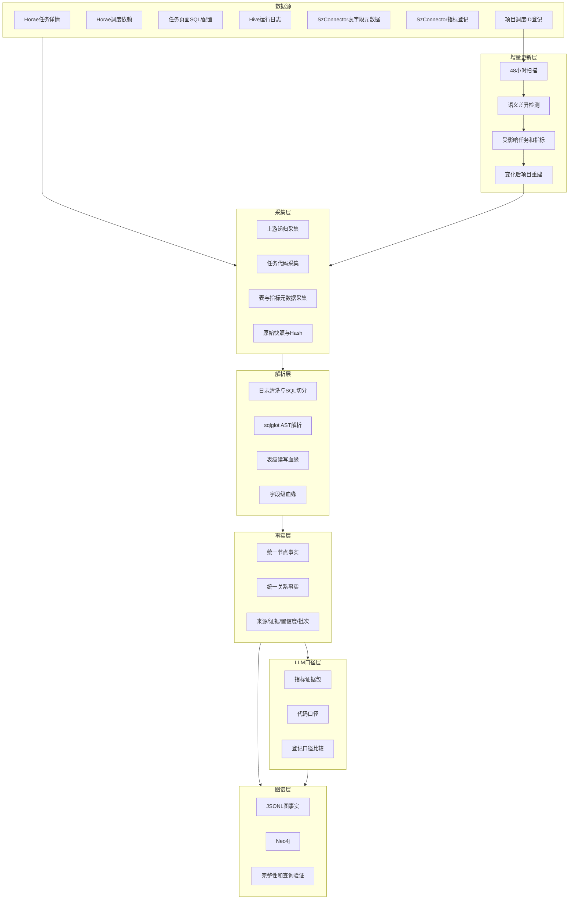

# 大数据代码逆向知识图谱技术方案

## 1. 建设目标

本项目从调度任务和实际运行代码出发，逆向还原大数据加工逻辑，建设“双层知识图谱”：

- 底层代码语义图：调度任务、运行日志、SQL、表、字段及血缘。
- 上层业务数据资产图：指标、登记口径、代码口径、负责人及数据分层。
- 两层通过`READS`、`WRITES`、`PRODUCES`、`CONSUMES`、`COMPUTED_BY`、`STORED_IN`、`DERIVED_FROM`等关系连接。

图谱后续面向人员、智能体和大模型，支持代码口径、业务口径、上下游血缘、变更影响、资产发现和治理审计等场景。

## 2. 当前建设状态

当前已完成单项目端到端原型，入口为20个结果任务ID：

```text
结果任务ID
→ 递归采集完整上游
→ 获取任务代码和运行SQL
→ SQL及字段血缘解析
→ 统一事实建模
→ LLM代码口径生成与登记口径比较
→ Neo4j导入和验证
→ 48小时增量变化检测
```

`trial_project`当前规模：

| 内容 | 数量 |
|---|---:|
| 图节点 | 56,619 |
| 图关系 | 104,828 |
| 调度任务 | 2,154 |
| 数据表 | 3,197 |
| 字段 | 44,904 |
| SQL语句 | 3,335 |
| 指标 | 319 |
| 代码口径 | 319 |
| 口径比较 | 319 |
| 字段血缘 | 13,350 |

完整性验证结果：缺失边端点、必填属性缺失、孤立节点均为0。

## 3. 总体架构



## 4. 数据分层约定

券商大数据标准链路为：

```text
odata → pdata → dm_index_n（指标层）→ dm（宽表层）→ 数据服务
```

当前图谱建模到`dm`层，数据服务层暂缓。特殊链路允许绕过标准层级，但需要在后续治理查询中识别并提示。

## 5. 采集层

### 5.1 调度入口

用户在项目登记表中维护：

- 结果任务ID：系统以此为入口向上递归穿透。
- 补充任务ID：用于无法通过标准调度依赖发现的特殊任务。

系统不是只采集入口任务，而是持续穿透到没有上游依赖的源头任务。

### 5.2 代码来源规则

| 任务类型 | 权威代码来源 | 说明 |
|---|---|---|
| `hiveTask` | 最新成功运行日志 | 以实际运行SQL为准 |
| `hiveTask-2.0` | 最新成功运行日志 | 以实际运行SQL为准 |
| `sparkIndex` | 调度任务页面 | `prepare.sqls`用于识别目标写入表 |
| 其他非Hive任务 | 调度任务页面 | 页面SQL或配置为主 |

任务页面获取不到代码时，运行日志可作为兜底，但不能覆盖上述权威来源策略。

### 5.3 元数据来源

- Horae detail：任务类型、负责人、周期、集群等。
- Horae relation：任务上下游调度依赖。
- Horae page/log：设计配置和运行态SQL。
- SzConnector DMS：表、字段及注释。
- SzConnector indicator：指标名称、登记口径及存储位置。
- Git仓库：当前暂缓。

## 6. 解析层

### 6.1 SQL处理

1. 清理Spark/Hive配置、执行进度和引擎消息。
2. 从页面或日志中切分SQL语句。
3. 使用`sqlglot`按Spark方言解析。
4. 对不完整DDL或运行噪声使用正则保留表级读写事实。
5. 根据任务类型合并为唯一的策略SQL事实集。

### 6.2 表级血缘

核心方向约定：

```text
SqlStatement -[:READS]-> 来源Dataset
SqlStatement -[:WRITES]-> 目标Dataset
目标Dataset -[:DATASET_DEPENDS_ON]-> 来源Dataset
```

### 6.3 字段血缘

字段血缘采用保守策略：

- 明确表别名解析为高置信度。
- 单一来源表、Schema唯一匹配、星号展开和CTE传播为中置信度。
- 无法确认时不强行建立`DERIVED_FROM`。

因此“没有字段血缘边”表示当前证据不足，不等同于业务上绝对没有依赖。

## 7. 事实层

每个节点和关系统一记录：

```text
fact_type
project_key
graph_prefix
build_id
built_at
confidence
inferred
```

关系还可以记录来源SQL、任务、快照和解析方式。事实层以JSONL保存，作为Neo4j之外可审计、可重放的中间事实集。

## 8. 图谱模型

### 8.1 主要节点

- `Project`
- `ScheduleTask`
- `RuntimeLog`
- `SqlStatement`
- `Dataset`
- `Column`
- `Metric`
- `MetricDefinition`
- `Owner`
- `DataLayer`
- `EvidenceBundle`
- `PromptTemplate`
- `PromptRun`
- `ModelVersion`
- `CodeDefinition`
- `DefinitionComparison`

### 8.2 主要关系

- 调度：`HAS_ENTRY_TASK`、`DEPENDS_ON`
- 任务数据：`PRODUCES`、`CONSUMES`、`HAS_RUNTIME_LOG`、`EMITS_SQL`
- SQL数据：`READS`、`WRITES`、`DATASET_DEPENDS_ON`
- 字段：`HAS_COLUMN`、`DERIVED_FROM`
- 指标：`STORED_IN`、`COMPUTED_BY`、`HAS_DEFINITION`
- 归属：`OWNS`、`BELONGS_TO_LAYER`
- LLM：`HAS_EVIDENCE_BUNDLE`、`EVIDENCES_*`、`HAS_CODE_DEFINITION`、`GENERATED_BY`、`USED_*`、`HAS_COMPARISON`、`COMPARES_*`

详细定义见[GRAPH_MODEL.md](GRAPH_MODEL.md)。

## 9. LLM指标口径

### 9.1 证据组成

每个指标的证据包可以包含：

- 指标登记名称和登记口径。
- 指标存储表和字段。
- 生产任务。
- 写入SQL和相关来源SQL。
- 来源表、字段血缘和表元数据。
- Prompt模板ID、版本和Hash。

### 9.2 生成与比较

LLM先生成代码优先口径，再与登记口径比较。比较状态包括：

| 状态 | 当前数量 |
|---|---:|
| 一致 | 14 |
| 部分一致 | 137 |
| 冲突 | 30 |
| 登记缺失 | 41 |
| 代码证据不足 | 97 |

“代码证据不足”表示仍可查询指标、存储表、任务和登记说明，但现有SQL证据不足以确定完整计算公式、过滤条件或粒度。

### 9.3 轻量人工补充

当前不建设完整的人工口径审批体系，仅保留`manual_metric_overrides.json`扩展口。代码变化影响相关指标时，已有人工补充标记为`needs_review=true`。

## 10. 增量更新

### 10.1 第一版策略

```text
每天触发扫描器
→ 根据项目配置判断是否已满48小时
→ 刷新完整上游依赖和任务代码
→ 执行采集质量门禁
→ 比较原始Hash和SQL语义Hash
→ 无语义变化则结束
→ 有变化则计算受影响下游任务和指标
→ 调用项目完整流水线重建
```

第一版选择“轻量检测、变化后整项目重建”，暂不直接局部修改Neo4j。

### 10.2 检测内容

- 任务新增和删除。
- 调度依赖新增和删除。
- 任务类型、负责人等元数据变化。
- 页面SQL和Hive运行SQL变化。
- 仅格式变化与语义变化区分。
- 已刷新表Schema和指标登记变化。

### 10.3 质量门禁

出现以下情况时停止本轮更新并保留旧基线：

- 入口任务缺失。
- 上游穿透错误。
- 任务详情采集失败。
- 页面代码请求失败。
- Hive任务缺少最新成功日志。
- 日志请求失败。

失败记录写入`incremental/failures/`，不会触发图谱重建。

### 10.4 产物

```text
incremental/current_snapshot.json
incremental/state.json
incremental/changes/<时间>.json
incremental/failures/<时间>.json
incremental/scan.lock
```

详细操作见[INCREMENTAL_UPDATE.md](INCREMENTAL_UPDATE.md)。

## 11. 图谱发布与验证

每次构建执行：

- 必填属性检查。
- 边端点检查。
- 孤立节点检查。
- 置信度分布检查。
- 表和指标覆盖率检查。
- 离线血缘路径查询。
- Neo4j节点、边、标签和关系数量验证。

当前Neo4j导入为全量替换。后续局部更新需要引入暂存图、构建版本和原子发布，不能直接边扫描边修改正式图。

## 12. 查询层规划

查询层定位为“图事实查询引擎 + 证据服务 + 智能解释层”，后续分为三种能力：

1. 确定性图查询：指标、任务、表、字段、上下游和影响范围。
2. 语义检索：中文名称、别名、描述和相似指标搜索。
3. 混合问答：图谱确定事实范围，LLM负责解释并引用证据。

第一版确定12个查询原语：

- `search_entities`
- `resolve_entity`
- `get_metric_context`
- `get_task_context`
- `get_dataset_context`
- `get_column_context`
- `trace_upstream`
- `trace_downstream`
- `analyze_impact`
- `compare_metric_definitions`
- `find_definition_issues`
- `explain_lineage_path`

LLM不直接执行任意Cypher，而是将自然语言转换为受控查询计划，再由参数化模板访问Neo4j。

所有原语使用统一响应协议，包含`status`、`data`、`entities`、`paths`、`evidence`、`warnings`、`graph_context`、分页和诊断信息。业务证据不足返回`partial`，实体歧义返回`ambiguous`，不得伪装成确定答案。

详细协议、原语契约、限制和验收标准见[QUERY_LAYER_DESIGN.md](QUERY_LAYER_DESIGN.md)。

当前已完成Python查询内核、CLI、统一JSON Schema和12个原语的真实Neo4j验证。REST、MCP和可视化界面尚未封装。

## 13. 安全与审计

- Cookie、Token、API Key、Neo4j密码不得进入代码仓库。
- 真实SQL、运行日志、表样例和图谱产物不进入源码Git仓库。
- 向外部LLM发送SQL和元数据前需要明确授权。
- 每次LLM调用保存模型版本、证据包、输入Hash和状态。
- 查询层后续需要增加项目、表、字段级权限和查询审计。

## 14. 当前边界与后续路线

当前未完成：

- Git设计态代码采集。
- 数据服务、接口、报表和推数节点。
- 任务级Neo4j局部更新。
- 多版本时间图和历史差异查询。
- 正式查询API、智能体工具和用户界面。
- 第二个项目的跨项目复用验证。

推荐下一阶段：

1. 实际执行一次在线增量扫描，验证Horae刷新性能和变更报告。
2. 使用第二个项目验证登记驱动的复用能力。
3. 对97个代码证据不足指标分类，针对性增强采集或解析。
4. 定义查询层MVP的接口契约和参数化Cypher模板。
5. 再评估任务级局部更新和Neo4j原子发布。
